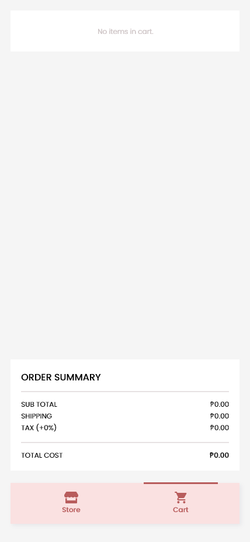

# Mobile Seoul Soul App

A mobile kpop merchandise store for a course in CIIT College of Arts and Technology made using Flutter.

- [Nadji Tan](https://github.com/Kapatid) (Kapatid) - Frontend
- [Jeremy Habal](https://github.com/J-Habal) (J-Habal) - UI/UX Design
- [Gabriel Verceles](https://github.com/Koruuin) (Koruuin) - Frontend & Documentation
- [Jerwin Fabelico](https://github.com/Omni-ssiah) (Omni-ssiah) - Frontend & Documentation

## Sample Images

  
  
  

